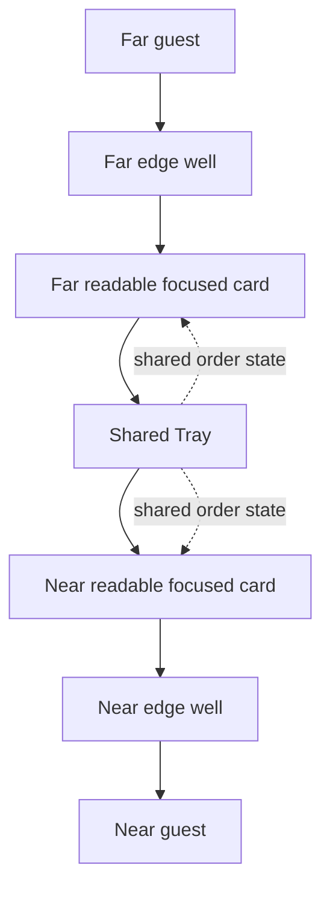

# Experience Concept

## Concept Summary

Gedulgt Table Menu is an interactive, projection-based cocktail menu for Gedulgt. A projector casts the menu onto a round table, while a camera tracks hand movement above the table. Guests explore drinks through motion, light, and card-like reveals instead of reading a static printed menu.

The prototype should support the same experience through a normal web browser with mouse input. Web support is for testing and demonstration, not a separate desktop UI.

The experience should feel like a hidden artifact inside Gedulgt's mysterious bar universe: dark, quiet, exclusive, and responsive to the guest's hand entering the light.

## Physical Setup

The intended physical setup:

- A projector is mounted above the table and points downward.
- A camera is mounted near the projector and sees the guest's hand over the projection area.
- The browser runs full screen and is projected onto the table surface.
- The table is treated as a circular active field inside the rectangular viewport.
- Two guests are assumed to sit across from each other: near side and far side.

The projection itself should not expose normal browser chrome, accessibility outlines, visible debug UI, or conventional controls during guest use. Debug and calibration tools can exist behind query params or shortcuts.

## Guest Mental Model

The guest should understand the table as a single projected object:

1. The table is quiet and mostly dark.
2. A subtle Gedulgt mark and light cue suggest the menu is hidden in the projection.
3. Placing a hand in the light wakes the menu.
4. A short onboarding sequence teaches the three essential interactions.
5. Drinks orbit around the table as a mirrored wheel.
6. The focused drink can be revealed by flipping its card.
7. The focused drink can be dragged or swiped into the Tray.
8. Selected drinks gather as tokens in the center.
9. The Tray shows a compact running total.
10. Inactivity or edge-well deactivation returns the table to dormant.

The product should not feel like a kiosk, landing page, ordering tablet, or normal e-commerce cart. It is a projected ritual that happens to collect an order.

## Spatial Model

The projection is a round active field with two readable halves:

```text
                 FAR GUEST

              [far edge well]

          far mirrored focused card
       ghosted drinks around upper arc

                  [Tray]

       ghosted drinks around lower arc
         near mirrored focused card

             [near edge well]

                NEAR GUEST
```

The mirroring exists so the far guest can read and interact from the opposite side. It should still feel like one shared visual system, not two separate menus.



## Experience Principles

- **Mystery first:** the menu appears through light, smoke, glass, and reveal rather than obvious app UI.
- **One shared table:** both guests see and affect one shared state.
- **Learn by doing:** onboarding proves motion ability through short required actions.
- **Focused clarity:** only the focused drink is visually dominant; other drinks are ghosted.
- **Practical at the center:** selected drinks and total price must remain legible without turning into a conventional cart.
- **Mouse mirrors gestures:** the web prototype uses mouse actions that map to the same semantic actions as future gestures.

## Design Rationale

This project connects to Don Norman's emotional design layers:

- **Visceral:** the dark projection, prismatic light, smoke, and glass glyphs create immediate mystery and exclusivity.
- **Behavioral:** the interaction model stays simple: browse, reveal, add, confirm.
- **Reflective:** the table menu should become a memorable part of the Gedulgt visit, not just a practical menu replacement.

The onboarding and contextual help support behavioral clarity. The dormant state, mirrored table, and order ritual support the reflective memory of the experience.

## Practical Setup Checklist

- Browser is full-screen on the projector output.
- Projection fills the round table as closely as practical.
- Camera sees the active hand area without the guest blocking the full table.
- Tracking preview is hidden during guest use.
- Calibration maps camera coordinates into the projected table bounds.
- Near/far orientation is confirmed before demo.
- The first guest starts from the near side by default.

## Non-Goals For This Pass

- No backend ordering workflow.
- No bartender/service integration.
- No accessibility/focus design.
- No final hand gesture tuning.
- No final drink photography or media.
- No independent multi-user ordering.

Related docs: [README](./README.md), [Interaction Model](./interaction-model.md), [Visual System](./visual-system.md), [Technical Architecture](./technical-architecture.md), [Refactor Plan](./refactor-plan.md).
