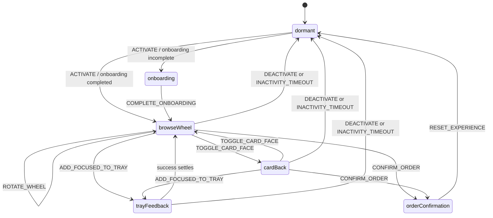

# Interaction Model

## State Overview

The Gedulgt Table Menu is driven by a small experience state machine. Mouse, touch, and future hand gestures should all dispatch the same semantic actions.

Implementation may represent `cardBack` as `phase: "browseWheel"` plus `cardFace: "back"`. The diagram separates it to make the user-visible behavior clear.

## Phases

| Phase | Purpose | Entry | Exit |
| --- | --- | --- | --- |
| `dormant` | Hide the menu in a quiet branded light state. | Initial load, reset, inactivity timeout, deactivate. | Activation through hand/mouse edge well or first hand in light. |
| `onboarding` | Teach and prove the required interactions. | Activation when onboarding is incomplete. | Complete swipe, tap, and drag-to-Tray steps. |
| `browseWheel` | Main menu exploration. | Onboarding completion or activation after onboarding was already completed. | Flip, add, order confirmation, deactivate, timeout. |
| `trayFeedback` | Short success or refusal feedback after an add attempt. | Add focused drink to Tray or attempt to exceed max order. | Automatically settles back to browse. |
| `orderConfirmation` | Waiter-facing readable summary. | Confirm from Tray when at least one drink is selected. | Manual reset to dormant. |

## Semantic Actions

| Action | Meaning | Mouse/Web Mapping | Future Gesture Mapping |
| --- | --- | --- | --- |
| `ACTIVATE` | Wake the menu from dormant. | Hold/click near/far edge well or initial interaction in the light cue. | Intentional activation gesture in projection area. |
| `DEACTIVATE` | Return to dormant intentionally. | Hold near/far edge well for `1.2s`. | Same semantic hold gesture. |
| `COMPLETE_ONBOARDING_STEP` | Mark current onboarding step successful. | Complete the requested mouse action. | Complete the requested hand action. |
| `ROTATE_WHEEL` | Change the focused drink. | Horizontal drag/swipe. | Horizontal hand swipe. |
| `TOGGLE_CARD_FACE` | Flip focused drink front/back. | Click focused card. | Future flip/reveal gesture. |
| `ADD_FOCUSED_TO_TRAY` | Add focused drink quantity to Tray. | Drag/swipe focused card inward. | Inward hand movement toward Tray. |
| `DECREMENT_TRAY_ITEM` | Reduce quantity/remove selected token. | Click/tap Tray token. | Future token remove gesture. |
| `CONFIRM_ORDER` | Open waiter-readable order summary. | Click/tap Tray confirmation action. | Future confirm gesture. |
| `RESET_EXPERIENCE` | Clear live state and return dormant. | Reset action in confirmation. | Future reset/deactivate gesture. |

Exact gesture recognition thresholds are intentionally not defined yet.

## Dormant Flow

Dormant is the default quiet state. It should show:

- subtle Gedulgt mark
- faint projector pool/light cue
- prompt: `Place hand in light`
- near/far edge wells available as activation/deactivation zones

Dormant behavior:

- Activation opens onboarding if onboarding has not been completed locally.
- Activation skips directly to the wheel if onboarding is complete.
- Entering dormant clears current Tray items, focused drink, card face, failure counts, and transient feedback.
- Entering dormant does not clear persisted onboarding completion.

## Onboarding Flow

Onboarding is forced once on the device/browser. It is primarily presented to the near side by default. The opposite side can remain visually ambient, because the goal is to teach the initiating guest without making the projection feel like two separate screens.

Required steps:

1. `Swipe to browse`
   - Guest completes a horizontal drag/swipe.
   - Success: animated hand line icon plus light pulse.
2. `Tap to reveal`
   - Guest clicks/taps the focused card.
   - Success: card flips and light pulse confirms.
3. `Drag to tray`
   - Guest drags/swipes the focused card inward to the Tray.
   - Success: selected token appears and onboarding completes.

After onboarding:

- Persist onboarding completion in local browser memory.
- Clear any onboarding-only Tray test item if needed.
- Enter `browseWheel`.

## Mirrored Wheel

The wheel uses six canonical drinks, using the first six drinks in the current data file for v1. These are rendered as twelve visible cards:

- six near-side cards, readable from the near guest
- six far-side cards, readable from the far guest

The duplicate cards are visual mirrors only. They must not create duplicate drink data.

Shared state:

- one focused drink
- one card face
- one Tray
- one order confirmation
- one input lockout timer

Focused drink behavior:

- The focused drink appears highlighted near both guests.
- Both focused mirrored cards flip together.
- Surrounding drinks are ghosted and lower emphasis.
- Horizontal rotation changes the focused canonical drink and updates both mirrored halves.

## Card Flip

Front face:

- abstract glass glyph or future drink media
- drink name

Back face:

- drink name
- flavor words
- short description
- ingredients
- creator
- price

Flip rules:

- Click/tap focused card toggles front/back.
- Flip is optional.
- The focused drink can be added from either side, whether front or back is showing.
- Both mirrored focused cards flip together.

## Tray Behavior

The Tray is the central radial selected-drink area.

Rules:

- Maximum total selected drinks: `6`.
- Adding the same drink increases its quantity.
- Adding beyond six total selected drinks fails and triggers a restrained Tray-full pulse.
- Selected tokens show a glyph plus quantity.
- Tray tokens are radial, not a normal list.
- Clicking/tapping a token decrements quantity.
- If quantity reaches zero, remove the token.
- The focused drink remains focused after a successful add.

Add feedback:

- brief success light pulse
- selected token appears or quantity increments
- no automatic rotation after add

## Order Confirmation

The Tray can bloom into a readable order confirmation when at least one drink is selected.

Default Tray confirmation action copy:

- `Order drinks`

Confirmation content:

- title: `Your order`
- selected drink names
- quantities
- individual prices
- total price
- compact DKK format, e.g. `110,-` and `Total 690,-`
- reset/close action

Confirmation behavior:

- It is visual only.
- It is meant to be shown to a waiter.
- It does not submit to a backend.
- Manual reset clears live order state and returns to dormant.

## Two-Guest Interaction Rule

Both near and far sides can interact after onboarding. The app should infer side from table half:

- lower half = near side
- upper half = far side

After a valid action, the side that triggered it owns a `700ms` input lockout. During this window, actions from the opposite side are ignored. This prevents the shared state from thrashing if both guests move at once.

The lockout should not make the app feel unresponsive. It only protects state-changing actions such as rotate, flip, add, decrement, confirm, and deactivate.

## Inactivity Timeout

If no valid interaction occurs for `60s`, the app returns to dormant.

Timeout should:

- clear live Tray and focus state
- preserve onboarding completion
- fade out the active table visuals
- return to subtle Gedulgt mark and light cue

## Contextual Help

Help cues appear only when needed:

- after repeated failed attempts
- when the guest starts but does not complete the current action
- when an add is attempted but the Tray is full

Help cues should be diegetic:

- projected hand line icon
- motion trace
- small phrase
- light pulse on success

Avoid persistent instructional clutter during normal browsing.

Related docs: [README](./README.md), [Experience Concept](./experience-concept.md), [Visual System](./visual-system.md), [Technical Architecture](./technical-architecture.md), [Refactor Plan](./refactor-plan.md).
